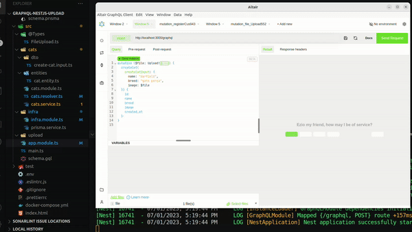
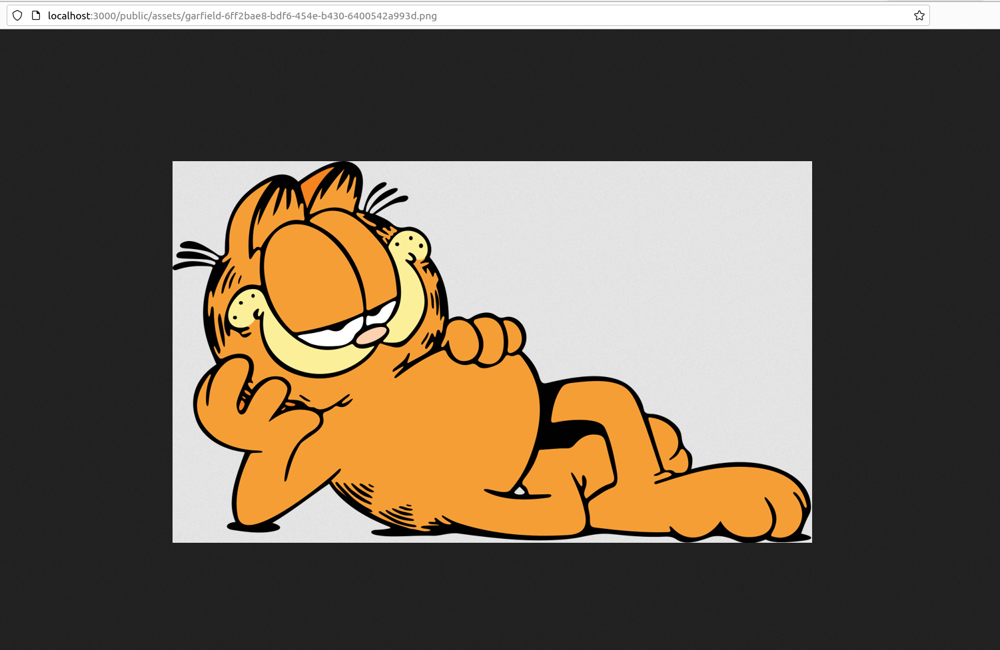

# Upload de arquivos com Nestjs e Graphql

> Caso queira [um vídeo explicando em detalhes](https://www.linkedin.com/posts/thalles-v%C3%ADctor_nestjs-graphql-nestjs-activity-7076179915573796865-b5Ap), aproveite e me segue lá no linkedin.

Para iniciar com esse projeto é nessário que já tenha integrado o graphql com o nestjs. Caso ainda não tenha, você pode fazer dessa forma seguindo os passo a passo na [documentação do nestjs no módulo de Graphql](https://docs.nestjs.com/graphql/quick-start), lembrando que nesse projeto eu estou ultilizando o code-first. Para este projeto também estou ultilizando o prisma, mas isso é uma escolha mesmo por ele ser mais símples, o que fica a cardo de vocês decidirem qual usar.

## Instalação das dependências
Para fazer o upload dos arquivos é necessário que tenha a biblioteca [graphql-upload](https://www.npmjs.com/package/graphql-upload) que contêm um middleware e um scalar type que vamos utilizar para trabalhar com upload de arquivos no graphl com o nestjs, semelhantemente ao multer para rest api.

```console
npm i graphql-upload
```

### Configurações no projeto

Adicionar as seguintes informações no [tsconfig.json](./tsconfig.json).

```json
"module": "Node16",  //"node16" ou "nodenext".
"allowJs": true,
"maxNodeModuleJsDepth": 0
```
informações disponível em: https://github.com/jaydenseric/graphql-upload#requirements.


### Aplicando o middleware
No arquivo [main.ts](./src/main.ts) temos que aplicar o middleware da biblioteca graphql-upload. Para conseguir importar, ultilizei o conceito de dynamic imports, caso queira saber mais recomendo ler o artigo: https://javascript.info/modules-dynamic-imports

```ts
  const { default: graphqlUploadExpress } = await import(
    'graphql-upload/graphqlUploadExpress.mjs'
  );
  app.use(graphqlUploadExpress({ maxFileSize: 5000000, maxFiles: 10 }));
```

## Iniciando o desenvolvimento do projeto

### Criando a entidade do projeto
Como em qualquer projeto, o que eu sempre gosto de começar a fazer é criar as entidades pois é ela é a forma em que vamos moldar as informações. Para isso criei uma entdiade (Object Type para o GraphQL)  que vai representar nossa entidade gato. Também já apliquei os decorators do graphql para representalo como um object type.

[cat.entity.ts](./src/cats/entities/cat.entity.ts)
```ts
import { ObjectType, Field } from '@nestjs/graphql';
import { v4 as uuid_v4 } from 'uuid';

interface CatEntityProps {
  name: string;
  breed: string;
  image: string;
}

@ObjectType()
export class CatEntity {
  @Field()
  id: string;

  @Field(() => String)
  name: string;

  @Field(() => String)
  breed: string;

  @Field(() => String)
  image: string;

  @Field(() => Date)
  created_at: Date;

  constructor({ name, breed, image }: CatEntityProps) {
    this.id = uuid_v4();
    this.name = name;
    this.breed = breed;
    this.image = image;
    this.created_at = new Date();
  }
}

```

### Criando o tipo File upload para tiparmos o arquivo vindo do client.

Com esse tipo vamos consegui tipar o arquivo; no nosso caso imagem, para comseguirmos tratar os a stream vinda do usuário.

[FileUload.ts](./src/%40Types/FileUpload.ts)
```ts
import { Stream } from 'stream';

export interface FileUpload {
  filename: string;
  mimetype: string;
  encoding: string;
  createReadStream: () => Stream;
}
```

### Crinado o Input Type da criação do gato

A criação do input type é da mesma forma tradicional só que com a diferença que estamos utilizando no campo **image** o tipo para o typescript que ele é a promessa de uma arquivo, e para o tipo do grapqhl que ele é um campo que tem o tipo de um GraphQLUpload que é um Scalar Type que veio da lib graphql-upload. Perceba que novamente eu ultilizei recurso de imports dynamics para importar o GraphQLUpload.

```ts
import { InputType, Field } from '@nestjs/graphql';
import { FileUpload } from 'src/@Types/FileUpload';
import { GraphQLScalarType } from 'graphql';

let GraphQLUpload: GraphQLScalarType;

import('graphql-upload/GraphQLUpload.mjs').then(({ default: Upload }) => {
  GraphQLUpload = Upload;
});

@InputType()
export class CreateCatInput {
  @Field(() => String)
  name: string;

  @Field(() => String)
  breed: string;

  @Field(() => GraphQLUpload)
  image: Promise<FileUpload>;
}
```

## Salvando a os dados no servidor
Agora que já criamos os tipos e a estrutura da entidade chegou a hora de crirar os módulos que vão tratar da persistência no servidor.

Para tratar o salvamento da imagen criei uma função que primeiro vai estruturar o nome da imagen, pois queremos que ela seja única para não ter conflito com outras imagens, logo em seguida ela vai receber a responsabilidade de salvar a imagen no disco e passar os dados para o nosso serviço de repositório onde vai persistir as informações.

[cats.service.ts](./src/cats/cats.service.ts)
```ts
import { HttpException, HttpStatus, Injectable } from '@nestjs/common';
import { CreateCatInput } from './dto/create-cat.input';
import fs from 'fs';
import { join } from 'path';
import { PrismaService } from 'src/infra/prisma.service';
import { CatEntity } from './entities/cat.entity';
import { v4 as uuid_v4 } from 'uuid';

@Injectable()
export class CatsService {
  constructor(private readonly prismaService: PrismaService) {}

  async create({ breed, name, image }: CreateCatInput) {
    const { createReadStream, filename } = await image;

    const [image_title, image_extension] = filename.split('.');

    const imageInformation = {
      id: uuid_v4(),
      title: image_title,
      extension: image_extension,
    };

    const structure_image_name = `${imageInformation.title}-${imageInformation.id}.${imageInformation.extension}`;

    //Saving image in disk
    new Promise(async (resolve) => {
      createReadStream()
        .pipe(
          fs.createWriteStream(
            join(process.cwd(), `/src/upload/${structure_image_name}`),
          ),
        )
        .on(
          'finish',
          () => resolve, //When resolve he return this information in promise, but I didn't not use.
        )
        .on('error', (error) => {
          console.log(error);

          throw new HttpException(
            'Could not save image',
            HttpStatus.INTERNAL_SERVER_ERROR,
          );
        });
    });

    //Create Entity before save in database
    const catEntity = new CatEntity({
      name: name,
      breed: breed,
      image: structure_image_name,
    });

    //Saving then entity in database
    const catCreated = await this.prismaService.cat.create({
      data: catEntity,
    });

    //Send Cat back, but change cat image passing the application's domain
    return {
      ...catCreated,
      image: `http://localhost:3000/public/assets/${catCreated.image}`,
    };
  }
}
```

agora que já temos uma função no nosso serviço que vai tratar de salvar a imagen e também de enviar as informações para que o repositório salve no banco, vamos criar a o resolver que vai receber esses dados vindos do client. Basicamente o que fazemos é criar uma *mutation* que o tipo dela é o [CatEntity](./src/cats/entities/cat.entity.ts) chamada de createCat que vai receber um parâmetro createCatInput em que o tipo dele é o nosso [CreateCatInput](./src/cats/dto/create-cat.input.ts).

[cats.resolver.ts](./src/cats/cats.resolver.ts)
```ts
import { Resolver, Mutation, Args } from '@nestjs/graphql';
import { CatsService } from './cats.service';
import { CatEntity } from './entities/cat.entity';
import { CreateCatInput } from './dto/create-cat.input';

@Resolver()
export class CatsResolver {
  constructor(private readonly catsService: CatsService) {}

  @Mutation(() => CatEntity)
  async createCat(@Args('createCatInput') createCatInput: CreateCatInput) {
    return await this.catsService.create(createCatInput);
  }
}
```
## Testando a aplicação
Em fim cheamos a hora de testar a aplicação para isso não vamos utilizar o playground do apollo mas sim outro client que é o [Altair](https://altairgraphql.dev/), ele possui mais recursos que o apollo e um deles é a possibilidade de fazer upload de arquivos.




## Implementando static assets no servidor

Para que outros clients consigam acessar os arquivos do nosso servidor devemos habilitar usando os static assets e para fazer isso no nest devemos tipar o generic da funcão create com o **NestjsExpressApplication** e depois usar o **useStaticAssets** do app passando o caminho e o prefixo para acessar a url.

```ts
import { NestFactory } from '@nestjs/core';
import { AppModule } from './app.module';
import { NestExpressApplication } from '@nestjs/platform-express';
import { join } from 'path';

async function bootstrap() {
  const app = await NestFactory.create<NestExpressApplication>(AppModule);

  app.useStaticAssets(join(process.cwd(), 'src', 'upload'), {
    prefix: '/public/assets',
  });

  ...
}
bootstrap();
```

Para testar basta acessar o navegador com a url da imagen.



## Opcional
Caso queiram desabilitar contra ataques CSRF basta ir no [app.module.ts](./src/app.module.ts) e colocar a **csrfPrevention** para ***false***

```ts
@Module({
  imports: [
    ...
    GraphQLModule.forRoot<ApolloDriverConfig>({
      ...
      csrfPrevention: false, //optional
    }),
  ],

  ...
})
export class AppModule {}
```